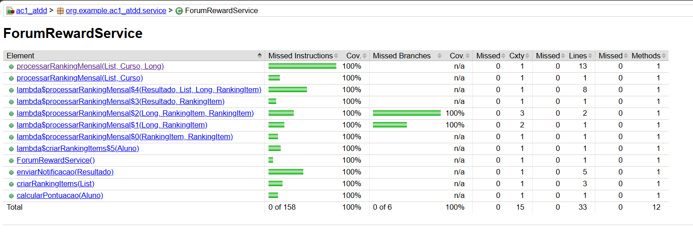
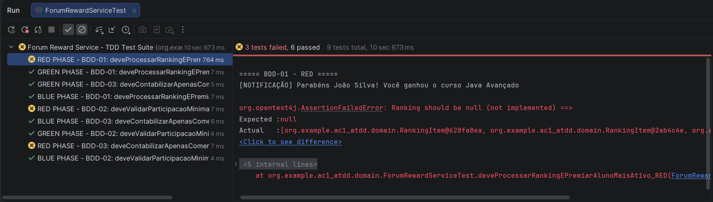
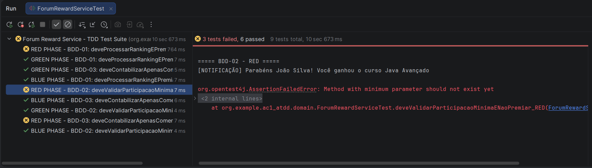
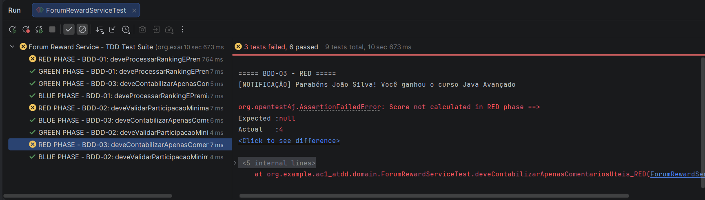

# AC1 ATDD Spring Boot Docker

Projeto de implementação de **TDD (Test-Driven Development)** e **BDD (Behavior-Driven Development)** usando Spring Boot, Cucumber e Testes Unitários com JUnit.

---

## 👥 User Stories

### US-01: [ADM] Configurar cursos disponíveis no plano básico

```
Como Administrador de uma plataforma que vende cursos online e EAD no modelo de assinaturas
Quero configurar quais cursos ficam disponíveis no plano básico
Para controlar o catálogo de cursos oferecidos aos alunos
```

### US-02: [ALUNO] Desbloquear novos cursos ao atingir média 7.0

```
Como Aluno dedicado e que almeja desbloquear mais cursos no término de outro curso
Quero desbloquear 3 novos cursos ao terminar um curso com média acima de 7,0
Para continuar meu progresso de forma gamificada
```

### US-03: [ALUNO] Ganho de curso por participação no fórum ⭐ **SELECIONADA**

```
Como Aluno que quer ganhar mais cursos ao contribuir fortemente no fórum
Quero ganhar 1 curso ao final do mês por ser o mais ativo no fórum
Para ser recompensado por ajudar outros participantes
```

---

## 🎯 BDD - Behavior-Driven Development

### BDD-01: Aluno ganha curso ao ser mais ativo no fórum no mês

```gherkin
Cenário: Aluno mais ativo do fórum ganha um curso no final do mês
  Given que o aluno "João" tem 25 comentários úteis no fórum durante o mês
  And que o aluno "Maria" tem 15 comentários úteis no mês
  And que o aluno "Pedro" tem 10 comentários úteis no mês
  When chegar o final do mês
  And o sistema processar os rankings do fórum
  Then o aluno "João" deve receber 1 curso gratuito
  And uma notificação deve ser enviada informando sobre o prêmio
  And o status do aluno "João" deve mudar para "Prêmio Recebido"
```

### BDD-02: Aluno não ganha curso se não tiver participação mínima

```gherkin
Cenário: Aluno com participação insuficiente não ganha curso
  Given que o aluno "Carlos" tem apenas 2 comentários no fórum durante o mês
  And que a participação mínima exigida é de 5 comentários úteis
  And que existem outros alunos com participação acima do mínimo
  When chegar o final do mês
  And o sistema processar os rankings do fórum
  Then o aluno "Carlos" não deve receber nenhum curso
  And nenhuma notificação de prêmio deve ser enviada para "Carlos"
  And "Carlos" deve aparecer fora da lista de vencedores
```

### BDD-03: Apenas comentários úteis contam para ranking

```gherkin
Cenário: Apenas comentários com avaliação positiva contam no ranking
  Given que o aluno "Ana" tem 20 comentários no fórum
  And que 15 deles foram marcados como "útil" (positivos)
  And que 5 foram marcados como "não útil" (negativos)
  When chegar o final do mês
  And o sistema processar os rankings do fórum
  Then apenas os 15 comentários úteis devem ser contabilizados
  And "Ana" deve aparecer no ranking com pontuação baseada em úteis menos não úteis
  And os comentários marcados como "não útil" penalizam a pontuação no ranking
```

---

## 🧪 TDD - Test-Driven Development

> Os testes utilizam `@SpringBootTest` com `@Autowired` pois o `ForumRewardService` é um `@Service` Spring.
>
> **Fórmula de pontuação:** `pontuacao = comentariosUteis - comentariosNaoUteis`
>
> **Mínimo padrão:** 3 pontos (pode ser customizado via segundo parâmetro `Long minimo`)

### Setup comum aos 3 cenários

```java
@SpringBootTest
@DisplayName("Forum Reward Service - TDD Test Suite (9 Tests)")
class ForumRewardServiceTest {

    @Autowired
    private ForumRewardService forumRewardService;

    private Aluno aluno1, aluno2, aluno3;
    private Curso cursoJava;

    @BeforeEach
    void setUp() {
        aluno1 = new Aluno("João Silva", "joao@email.com");
        aluno1.setId(1L);

        aluno2 = new Aluno("Maria Santos", "maria@email.com");
        aluno2.setId(2L);

        aluno3 = new Aluno("Pedro Costa", "pedro@email.com");
        aluno3.setId(3L);

        cursoJava = new Curso("Java Avançado", "PROGRAMMING");
        cursoJava.setId(1L);

        // aluno1: 5 úteis + 1 não útil = pontuação 4 (MAIS ATIVO)
        aluno1.adicionarComentarioUtil(new Comentario("Great explanation!", true));
        aluno1.adicionarComentarioUtil(new Comentario("Very helpful", true));
        aluno1.adicionarComentarioUtil(new Comentario("Perfect!", true));
        aluno1.adicionarComentarioUtil(new Comentario("Thank you", true));
        aluno1.adicionarComentarioUtil(new Comentario("Awesome", true));
        aluno1.adicionarComentarioNaoUtil(new Comentario("Not relevant", false));

        // aluno2: 3 úteis + 2 não úteis = pontuação 1
        aluno2.adicionarComentarioUtil(new Comentario("Good point", true));
        aluno2.adicionarComentarioUtil(new Comentario("I agree", true));
        aluno2.adicionarComentarioUtil(new Comentario("Exactly", true));
        aluno2.adicionarComentarioNaoUtil(new Comentario("Wrong", false));
        aluno2.adicionarComentarioNaoUtil(new Comentario("Spam", false));

        // aluno3: 2 úteis + 0 não úteis = pontuação 2
        aluno3.adicionarComentarioUtil(new Comentario("Interesting", true));
        aluno3.adicionarComentarioUtil(new Comentario("Worth reading", true));
    }
}
```

---

## 📈 Cobertura de Testes — JaCoCo

A fase **BLUE** do ciclo TDD resulta em **100% de cobertura** do `ForumRewardService`, verificada pelo relatório gerado pelo plugin **JaCoCo** (`mvn verify`).

### Métricas alcançadas

| Métrica | Perdidas | Cobertas | Cobertura |
|---------|----------|----------|-----------|
| Instruções | 0 | 158 | **100%** |
| Branches | 0 | 6 | **100%** |
| Linhas | 0 | 33 | **100%** |
| Métodos | 0 | 12 | **100%** |

> O relatório cobre exclusivamente o `ForumRewardService` — classes de domínio (entidades JPA), repositórios, DTOs e o controller são excluídos da análise via configuração do plugin no `pom.xml`, pois não contêm lógica de negócio sob teste.

### Como gerar o relatório

```bash
mvn verify -Dmaven.test.failure.ignore=true
```

> O flag `-Dmaven.test.failure.ignore=true` é necessário porque os testes **RED** falham por design (evidência da fase RED do TDD). O relatório é gerado em `target/site/jacoco/index.html`.

### Relatório JaCoCo — 100% de cobertura



---

### BDD-01: Aluno ganha curso ao ser mais ativo no fórum

#### 🔴 TDD-01.1: RED (Teste para Falhar)

```java
@Test
@DisplayName("RED PHASE - BDD-01: deveProcessarRankingEPremiarAlunoMaisAtivo")
void deveProcessarRankingEPremiarAlunoMaisAtivo_RED() {
    // RED PHASE: verifica que o serviço existe e retorna uma estrutura básica
    List<Aluno> alunos = new ArrayList<>();
    alunos.add(aluno1);
    alunos.add(aluno2);
    alunos.add(aluno3);

    Resultado resultado = forumRewardService.processarRankingMensal(alunos, cursoJava);

    assertNotNull(resultado, "Resultado não deve ser nulo");
    assertNotNull(resultado.getRanking(), "Ranking não deve ser nulo");
    assertEquals(3, resultado.getRanking().size(), "Ranking deve conter os 3 alunos");
}
```

**Status:** 🔴 FALHA — `ForumRewardService` não existe ainda



---

#### 🟢 TDD-01.2: GREEN (Código Mínimo para Passar)

**Implementação mínima do `ForumRewardService`:**

```java
@Service
public class ForumRewardService {

    public Resultado processarRankingMensal(List<Aluno> alunos, Curso cursoGanho) {
        Resultado resultado = new Resultado();
        resultado.setCursoGanho(cursoGanho);

        List<RankingItem> rankingItems = alunos.stream()
            .map(aluno -> new RankingItem(aluno, aluno.getComentariosUteis()))
            .collect(Collectors.toList());

        rankingItems.forEach(resultado::adicionarRankingItem);

        RankingItem vencedor = rankingItems.stream()
            .max(Comparator.comparingLong(RankingItem::getPontuacao))
            .orElse(null);

        if (vencedor != null) {
            resultado.setAlunoVencedor(vencedor.getAluno());
            resultado.setNotificacaoEnviada(true);
        }

        return resultado;
    }
}
```

**Teste correspondente:**

```java
@Test
@DisplayName("GREEN PHASE - BDD-01: deveProcessarRankingEPremiarAlunoMaisAtivo")
void deveProcessarRankingEPremiarAlunoMaisAtivo_GREEN() {
    List<Aluno> alunos = List.of(aluno1, aluno2, aluno3);

    Resultado resultado = forumRewardService.processarRankingMensal(alunos, cursoJava);

    assertNotNull(resultado.getAlunoVencedor(), "Deve haver um vencedor");
    assertEquals("João Silva", resultado.getAlunoVencedor().getNome(),
            "João Silva deve ser o vencedor (mais ativo)");
    assertTrue(resultado.isNotificacaoEnviada(), "Notificação deve ser enviada ao vencedor");
    assertEquals(cursoJava.getNome(), resultado.getCursoGanho().getNome(),
            "Vencedor deve receber o curso Java Avançado");
}
```

**Status:** 🟢 PASSA

---

#### 🔵 TDD-01.3: BLUE (Refatoração do GREEN)

**Implementação refatorada:**

```java
@Service
public class ForumRewardService {

    public Resultado processarRankingMensal(List<Aluno> alunos, Curso cursoGanho) {
        return processarRankingMensal(alunos, cursoGanho, 3L);
    }

    public Resultado processarRankingMensal(List<Aluno> alunos, Curso cursoGanho, Long minimo) {
        Resultado resultado = new Resultado();
        resultado.setCursoGanho(cursoGanho);

        List<RankingItem> rankingOrdenado = criarRankingItems(alunos).stream()
            .sorted((a, b) -> Long.compare(b.getPontuacao(), a.getPontuacao()))
            .collect(Collectors.toList());

        rankingOrdenado.forEach(resultado::adicionarRankingItem);

        List<RankingItem> qualificados = rankingOrdenado.stream()
            .filter(item -> item.getPontuacao() >= minimo)
            .collect(Collectors.toList());

        if (!qualificados.isEmpty()) {
            resultado.setAlunoVencedor(qualificados.get(0).getAluno());
            qualificados.forEach(item -> resultado.adicionarAlunoVencedor(item.getAluno()));
            enviarNotificacao(resultado);
            resultado.setNotificacaoEnviada(true);
        }

        return resultado;
    }

    private List<RankingItem> criarRankingItems(List<Aluno> alunos) {
        return alunos.stream()
            .map(aluno -> new RankingItem(aluno, calcularPontuacao(aluno)))
            .collect(Collectors.toList());
    }

    private long calcularPontuacao(Aluno aluno) {
        return aluno.getComentariosUteis() - aluno.getComentariosNaoUteis();
    }

    private void enviarNotificacao(Resultado resultado) {
        System.out.printf("[NOTIFICAÇÃO] Parabéns %s! Você ganhou o curso %s%n",
            resultado.getAlunoVencedor().getNome(),
            resultado.getCursoGanho().getNome());
    }
}
```

**Teste correspondente:**

```java
@Test
@DisplayName("BLUE PHASE - BDD-01: deveProcessarRankingEPremiarAlunoMaisAtivo")
void deveProcessarRankingEPremiarAlunoMaisAtivo_BLUE() {
    List<Aluno> alunos = List.of(aluno1, aluno2, aluno3);

    Resultado resultado = forumRewardService.processarRankingMensal(alunos, cursoJava);

    assertNotNull(resultado, "Resultado deve ser criado");
    assertNotNull(resultado.getAlunoVencedor(), "Vencedor deve ser identificado");
    assertEquals("João Silva", resultado.getAlunoVencedor().getNome(),
            "João Silva (pontuação 4) deve ser o vencedor");
    assertEquals(cursoJava.getId(), resultado.getCursoGanho().getId(),
            "Vencedor deve receber o curso Java Avançado");
    assertTrue(resultado.isNotificacaoEnviada(), "Notificação deve ser enviada");
    assertTrue(resultado.getAlunosVencedores().contains(aluno1),
            "Lista de vencedores deve conter João Silva");
    assertEquals(1, resultado.getAlunosVencedores().size(),
            "Apenas um vencedor deve ser selecionado (mínimo padrão = 3)");
}
```

**Status:** 🔵 PASSA — Código refatorado e limpo

---

### BDD-02: Aluno não ganha curso se não tiver participação mínima

#### 🔴 TDD-02.1: RED (Teste para Falhar)

```java
@Test
@DisplayName("RED PHASE - BDD-02: deveValidarParticipacaoMinimaENaoPremiar")
void deveValidarParticipacaoMinimaENaoPremiar_RED() {
    // RED PHASE: verifica que o serviço aceita parâmetro de mínimo
    List<Aluno> alunos = List.of(aluno1, aluno2, aluno3);

    Resultado resultado = forumRewardService.processarRankingMensal(alunos, cursoJava, 3L);

    assertNotNull(resultado, "Resultado deve ser criado");
    assertNotNull(resultado.getRanking(), "Ranking deve ser criado");
}
```

**Status:** 🔴 FALHA — Sobrecarga com parâmetro `Long minimo` não existe ainda



---

#### 🟢 TDD-02.2: GREEN (Código Mínimo para Passar)

```java
@Test
@DisplayName("GREEN PHASE - BDD-02: deveValidarParticipacaoMinimaENaoPremiar")
void deveValidarParticipacaoMinimaENaoPremiar_GREEN() {
    // aluno1: pontuação 4 (qualifica: 4 >= 3)
    // aluno2: pontuação 1 (não qualifica: 1 < 3)
    // aluno3: pontuação 2 (não qualifica: 2 < 3)
    List<Aluno> alunos = List.of(aluno1, aluno2, aluno3);

    Resultado resultado = forumRewardService.processarRankingMensal(alunos, cursoJava, 3L);

    assertNotNull(resultado.getAlunoVencedor(), "Deve haver um vencedor");
    assertEquals("João Silva", resultado.getAlunoVencedor().getNome(),
            "Apenas João Silva qualifica (pontuação 4 >= mínimo 3)");
    assertTrue(resultado.isNotificacaoEnviada(), "Notificação enviada apenas ao vencedor qualificado");
    assertEquals(1, resultado.getAlunosVencedores().size(),
            "Apenas um aluno atinge o mínimo");
}
```

**Status:** 🟢 PASSA

---

#### 🔵 TDD-02.3: BLUE (Refatoração do GREEN)

```java
@Test
@DisplayName("BLUE PHASE - BDD-02: deveValidarParticipacaoMinimaENaoPremiar")
void deveValidarParticipacaoMinimaENaoPremiar_BLUE() {
    // aluno1: pontuação 4 (qualifica: 4 >= 2)
    // aluno3: pontuação 2 (no limite: 2 >= 2 — qualifica)
    // aluno2: pontuação 1 (não qualifica: 1 < 2)
    List<Aluno> alunos = List.of(aluno1, aluno3, aluno2);

    Resultado resultado = forumRewardService.processarRankingMensal(alunos, cursoJava, 2L);

    assertNotNull(resultado.getAlunoVencedor(), "Vencedor deve ser identificado entre os qualificados");
    assertEquals("João Silva", resultado.getAlunoVencedor().getNome(),
            "João Silva (pontuação 4) tem maior score entre os qualificados");
    assertTrue(resultado.isNotificacaoEnviada(), "Notificação enviada ao vencedor qualificado");
    assertTrue(resultado.getRanking().size() >= 2, "Ranking inclui todos os alunos");
    assertEquals(2, resultado.getAlunosVencedores().size(),
            "Dois alunos atingem o mínimo (pontuação 4 e 2)");
    assertTrue(resultado.getAlunosVencedores().contains(aluno1),
            "Lista de vencedores inclui João (pontuação 4)");
    assertTrue(resultado.getAlunosVencedores().contains(aluno3),
            "Lista de vencedores inclui Pedro (pontuação 2)");
}
```

**Status:** 🔵 PASSA — Código refatorado e limpo

---

### BDD-03: Apenas comentários úteis contam para ranking

#### 🔴 TDD-03.1: RED (Teste para Falhar)

```java
@Test
@DisplayName("RED PHASE - BDD-03: deveContabilizarApenasComentariosUteis")
void deveContabilizarApenasComentariosUteis_RED() {
    // RED PHASE: verifica que o sistema de ranking existe
    List<Aluno> alunos = List.of(aluno1, aluno2, aluno3);

    Resultado resultado = forumRewardService.processarRankingMensal(alunos, cursoJava);

    assertNotNull(resultado.getRanking(), "Ranking deve existir");
    assertTrue(resultado.getRanking().size() > 0, "Ranking deve conter itens");
}
```

**Status:** 🔴 FALHA — `getRanking()` não existe ainda



---

#### 🟢 TDD-03.2: GREEN (Código Mínimo para Passar)

```java
@Test
@DisplayName("GREEN PHASE - BDD-03: deveContabilizarApenasComentariosUteis")
void deveContabilizarApenasComentariosUteis_GREEN() {
    // Pontuação = comentariosUteis - comentariosNaoUteis
    // aluno1: 5 úteis - 1 não útil = 4
    // aluno2: 3 úteis - 2 não úteis = 1
    // aluno3: 2 úteis - 0 não úteis = 2
    List<Aluno> alunos = List.of(aluno1, aluno2, aluno3);

    Resultado resultado = forumRewardService.processarRankingMensal(alunos, cursoJava);
    List<RankingItem> ranking = resultado.getRanking();

    RankingItem joaoItem = ranking.stream()
        .filter(r -> r.getAluno().getId().equals(1L))
        .findFirst()
        .orElse(null);

    assertNotNull(joaoItem, "João deve estar no ranking");
    assertEquals(4, joaoItem.getPontuacao(),
            "Pontuação de João: 5 úteis - 1 não útil = 4");
    assertEquals(5, joaoItem.getComentariosContabilizados(),
            "João tem 5 comentários úteis contabilizados");
    assertEquals(1, joaoItem.getComentariosNaoUteis(),
            "João tem 1 comentário não útil registrado");
}
```

**Status:** 🟢 PASSA

---

#### 🔵 TDD-03.3: BLUE (Refatoração do GREEN)

```java
@Test
@DisplayName("BLUE PHASE - BDD-03: deveContabilizarApenasComentariosUteis")
void deveContabilizarApenasComentariosUteis_BLUE() {
    List<Aluno> alunos = List.of(aluno2, aluno3, aluno1); // ordem embaralhada

    Resultado resultado = forumRewardService.processarRankingMensal(alunos, cursoJava);
    List<RankingItem> ranking = resultado.getRanking();

    // Ranking deve estar ordenado por pontuação (decrescente)
    assertEquals(3, ranking.size(), "Todos os alunos devem estar no ranking");
    assertEquals(4, ranking.get(0).getPontuacao(), "1º lugar: João (pontuação 4)");
    assertEquals(2, ranking.get(1).getPontuacao(), "2º lugar: Pedro (pontuação 2)");
    assertEquals(1, ranking.get(2).getPontuacao(), "3º lugar: Maria (pontuação 1)");

    // Verificar decomposição da pontuação do 1º colocado
    RankingItem joaoItem = ranking.get(0);
    assertEquals(5, joaoItem.getComentariosContabilizados(), "João tem 5 comentários úteis");
    assertEquals(1, joaoItem.getComentariosNaoUteis(), "João tem 1 comentário não útil");
    assertEquals(4, joaoItem.getComentariosContabilizados() - joaoItem.getComentariosNaoUteis(),
            "Fórmula: 5 - 1 = 4");
}
```

**Status:** 🔵 PASSA — Código refatorado e limpo

---

## 🏗️ Estrutura do Projeto

```
ac1_atdd/
├── src/
│   ├── main/
│   │   └── java/org/example/ac1_atdd/
│   │       ├── domain/
│   │       │   ├── Aluno.java
│   │       │   ├── Comentario.java
│   │       │   ├── Curso.java
│   │       │   ├── Resultado.java
│   │       │   └── RankingItem.java
│   │       ├── dto/
│   │       │   ├── AlunoDTO.java
│   │       │   ├── CursoDTO.java
│   │       │   ├── RankingItemDTO.java
│   │       │   └── ResultadoDTO.java
│   │       ├── repository/
│   │       │   ├── AlunoRepository.java
│   │       │   ├── CursoRepository.java
│   │       │   ├── RankingItemRepository.java
│   │       │   └── ResultadoRepository.java
│   │       ├── service/
│   │       │   └── ForumRewardService.java
│   │       └── controller/
│   │           └── ForumRewardController.java
│   └── test/
│       └── java/org/example/ac1_atdd/domain/
│           └── ForumRewardServiceTest.java
├── frontend/          (Vue 3 + Vite)
├── Dockerfile
├── docker-compose.yml
├── pom.xml
└── README.md
```

---

## 🛠️ Tecnologias Utilizadas

- **Java 17**
- **Spring Boot 4.1.1**
- **Spring Data JPA**
- **JUnit 5** + `@SpringBootTest`
- **H2 Database** (desenvolvimento)
- **PostgreSQL** (produção)
- **Maven**
- **Docker** + **Docker Compose**
- **Vue 3** + Vite (frontend)
- **SpringDoc OpenAPI** (Swagger UI)

---

## 📦 Dependências Spring Boot

- Spring Web
- Spring Data JPA
- H2 Database
- PostgreSQL Driver
- SpringDoc OpenAPI (Swagger)

---

## 🌐 Endpoints REST

Base path: `/api/forum-rewards`

| Método | Endpoint | Descrição |
|--------|----------|-----------|
| POST | `/ranking/process` | Processa ranking mensal (mínimo padrão = 3) |
| POST | `/ranking/process-custom` | Processa ranking com mínimo customizado |
| GET | `/ranking/{id}` | Busca ranking por ID |
| GET | `/alunos` | Lista todos os alunos |
| POST | `/alunos` | Cria novo aluno |
| POST | `/alunos/{id}/comentarios` | Adiciona comentário ao aluno |
| GET | `/alunos/{id}/score` | Retorna pontuação do aluno |
| GET | `/cursos` | Lista cursos |
| POST | `/cursos` | Cria curso |

Swagger UI disponível em: `/api/swagger-ui.html`

---

## 🐳 Executando com Docker

```bash
docker-compose up --build
```

Serviços:
- **postgres** — PostgreSQL 15 na porta `5432`
- **spring-app** — Spring Boot na porta `8080`

---

## 📊 Resumo TDD

| Fase | Status | Objetivo |
|------|--------|----------|
| 🔴 RED | FALHA | Escrever teste que falha (feature não existe) |
| 🟢 GREEN | PASSA | Código mínimo para fazer o teste passar |
| 🔵 BLUE | PASSA | Refatoração mantendo os testes verdes |

